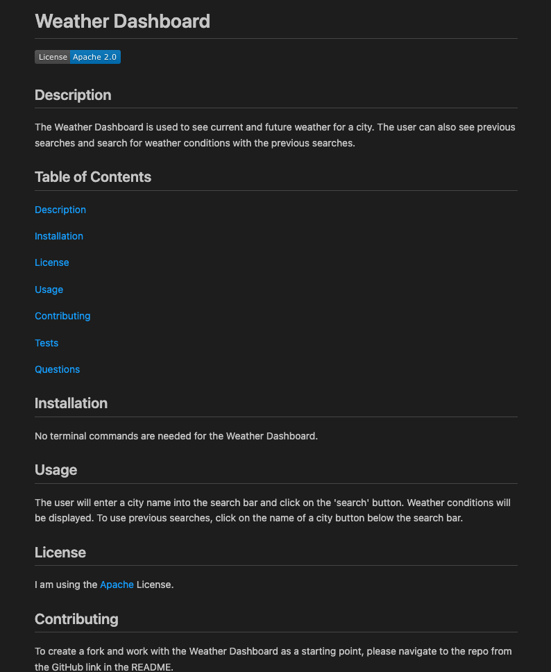

# README Generator (Module 09 Homework - Node.js)

The goal was to create a command line application that generates a professional README file by providing the user prompts and using the answers to generate a README. The requirements were:
- The user's entered title is displayed as the title of the README.
- The user's entered description, installation instructions, usage information, contribution guidelines, and test instructions are added to their corresponding sections of the README.
- The user will choose a license, the license' badge is added near the title of the README and the license information and link are added in the license section of the README.
- The user can enter their GitHub username and email address, and this information is added to the questions section with a link to their GitHub profile and their email.
- The table of contents is built with links that will take the user to the corresponding section of the README.

## Installation

To use the README Generator, you will need to follow these instructions:
- Download the project file to your computer.
- In command line:
  ```
  npm init
  ```
  ```
  npm install
  ```

## Usage

- To start the README Generator, run: 

  ```
  node index.js
  ``` 

  in the command line.

- If you choose not to answer a prompt in the terminal, that section will not be rendered in the generated README.


## Visual Example of Generated README



<br>

## Video Demo

[Link to Demo Video](https://watch.screencastify.com/v/u4xjKFBazWEmVx1MxotT)
